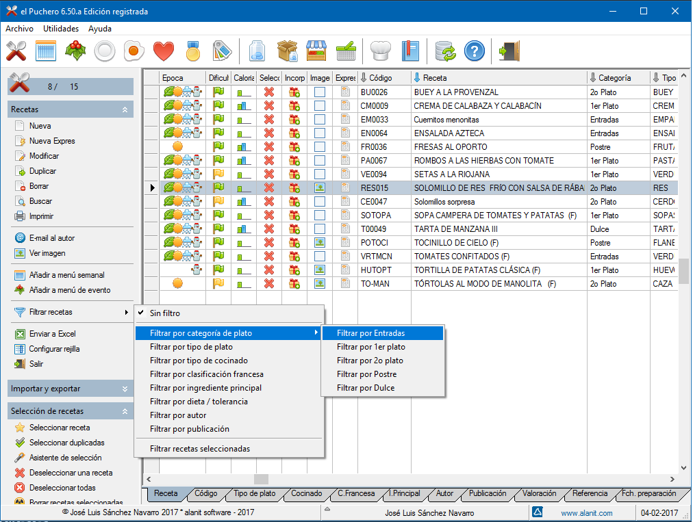

# el Puchero
Fuentes del programa el Puchero: http://www.alanit.com/software/el-puchero/

**el Puchero** es un **programa de organización de recetas de cocina**. Permite almacenar información sobre recetas de cocina clasificandolas por tipos de plato, por tipo de cocinado y en forma arborescente mediante la llamada *clasificación francesa*. Tiene funciones avanzadas de búsqueda y filtrado de recetas por múltiples críterios. Incorpora un fichero de ingredientes que permite realizar escandallos, fichero de proveedores de ingredientes, tabla de valoraciones de las recetas, fichero de autores y de publicaciones y sitios web relacionados con la cocina. 

Esta aplicación requiere Borland C, Harbour y FivewinHarbour para compilarse. Yo uso FWH 19.05 y la versión correspondiente de Harbour empaquetada por Fivetech. Para compilar el programa hay que make btc1905 que compila los fuentes y crea el ejecutable.

Mi editor es HippoEdit y el archivo puchero.heprj es el archivo de proyecto para ese editor.

La estructura de carpetas de la aplicación es la siguiente:

* ch - contiene archivos de cabecera del preprocesador
* datos - contiene datos de ejemplo del programa
* makefile - contiene los archivos de compilación y enlazado
* prg - contiene los fuentes del programa. No están todos los fuentes debido a que uso modificaciones a medida de FivewinHarbour y esos fuentes no son públicos.

Para cualquier consulta escribirme a [joseluis@alanit.com](mailto:joseluis@alanit.com)

Novelda, agosto de 2019. José Luis Sánchez Navarro

